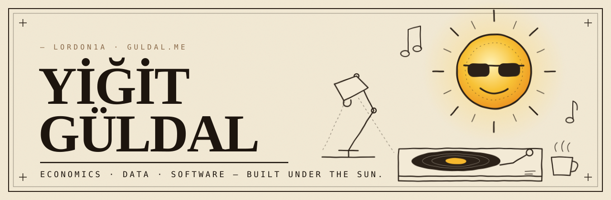

<!-- lordon1a/lordon1a — GitHub profile README -->
<!-- TODO: YOUTUBE_HANDLE, X_HANDLE ve EMAIL yer tutucularını gerçek bilgilerle değiştir. -->

  

  <a href="https://guldal.me"><b>Website</b></a> &nbsp;/&nbsp;
  <a href="https://radio.guldal.me"><b>Radio</b></a> &nbsp;/&nbsp;
  <a href="https://link.guldal.me"><b>Links</b></a> &nbsp;/&nbsp;
  <a href="https://youtube.com/@YOUTUBE_HANDLE"><b>YouTube</b></a> &nbsp;/&nbsp;
  <a href="https://x.com/X_HANDLE"><b>X</b></a> &nbsp;/&nbsp;
  <a href="https://www.linkedin.com/in/yigit-guldal"><b>LinkedIn</b></a> &nbsp;/&nbsp;
  <a href="mailto:EMAIL"><b>Get in touch</b></a>

I'm **Yiğit Güldal**, a.k.a. **lordon1a**. I study economics at Anadolu University and build software where markets, data and systems meet — from server-security plugins in Java to a real-time CRM in Flask, plus a few sunny experiments on the web.

I care about tools that make complex systems legible: **who can see what, which signals matter, and how data becomes a decision.** Some of my work is open source; the rest is private, but you'll find what it does below.

## Start here

<table>
  <tr>
    <td width="50%" valign="top">
      <b>01 / SERVER SECURITY</b>
      <h3><a href="https://github.com/lordon1a/SunshineCommandGuard">SunshineCommandGuard</a></h3>
      Hide commands from tab-complete, block their execution and keep your plugin list private — scoped per LuckPerms group, with an admin tool that explains every decision.
        
      <a href="https://github.com/lordon1a/SunshineCommandGuard/releases/latest">Get the plugin →</a>
    </td>
    <td width="50%" valign="top">
      <b>02 / INVESTIGATION</b>
      <h3><a href="https://github.com/lordon1a/SunshineSentinel">Sunshine Sentinel</a></h3>
      Turns scattered anti-cheat flags, blocked commands and world activity into one explainable risk timeline per player — and into reviewable incidents.
        
      <a href="https://github.com/lordon1a/SunshineSentinel">See how it works →</a>
    </td>
  </tr>
  <tr>
    <td width="50%" valign="top">
      <b>03 / PRODUCT</b> · 🔒 PRIVATE
      <h3><a href="https://guldal.me/projects/portfiva">Portfiva CRM</a></h3>
      A WhatsApp-first CRM for real-estate teams: pipelines, messaging, workflow automation and AI assistance on a modular Flask + PostgreSQL monolith.
        
      <a href="https://guldal.me/projects/portfiva">Read the case study →</a>
    </td>
    <td width="50%" valign="top">
      <b>04 / LIVE</b>
      <h3><a href="https://radio.guldal.me">Sunshine Radio</a></h3>
      A shared YouTube radio in a sunlit 3D room: everyone hears the same song, votes the queue and chats — while a turntable spins on the desk.
        
      <a href="https://radio.guldal.me">Tune in →</a>
    </td>
  </tr>
</table>

## On the workbench: Sunshine Bubbles

**Soap-bubble effects and abilities for a Minecraft server.**

Custom GLSL shaders draw the bubbles on the client, and a Paper plugin spawns and manages them with five abilities on top. It already runs in production behind a Velocity proxy.

**In active development.** The codebase is currently private.

## More things I've built

| Project | | What it is |
|---|---|---|
| [**SunshineWheel**](https://rehber.guldal.me/wheel-setup.html) | 🔒 private | Physical, animated fortune wheels for Paper servers — configured from a live web editor in the browser. |
| **Bubble Posteffect** | 🔒 private | A perspective-correct soap bubble in vanilla Minecraft, ray-traced with only a resource pack and a datapack. |
| **Steady State** | 🔒 private | An interactive economics study site: lessons, live graphs, formula sheets and spaced-repetition cards. |
| **commandcode-go-opencode** | 🔒 private | A tiny local bridge that speaks OpenAI- and Anthropic-compatible APIs for coding-agent clients. |
| [**portfolio-simple**](https://github.com/lordon1a/portfolio-simple) | public | [guldal.me](https://guldal.me) — a server-first editorial portfolio in Next.js. |
| [**link.guldal.me**](https://link.guldal.me) | public | My link page, with a Three.js sun that follows the time of day. |

## Toolbox

  
  
  
  
  
  
  
  
  
  

☀ built under the sun in Türkiye

